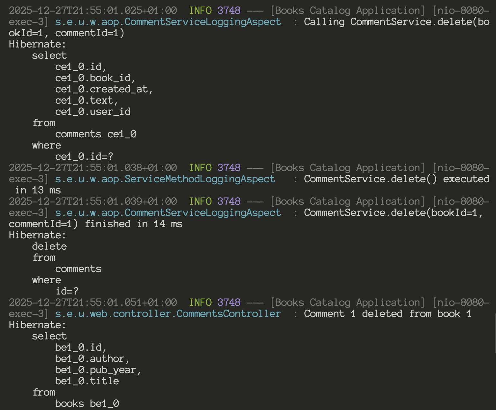
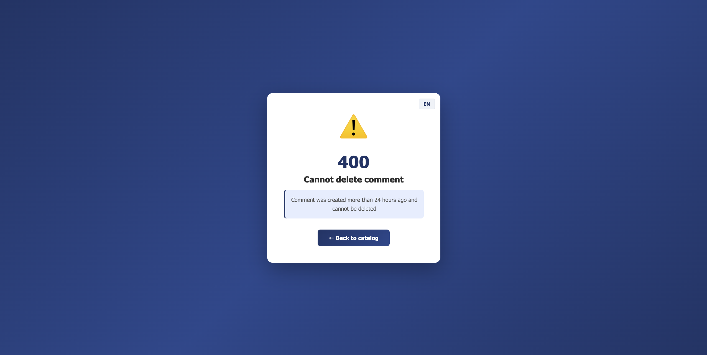
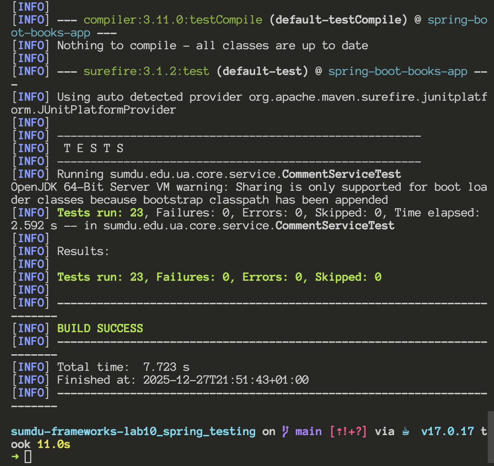
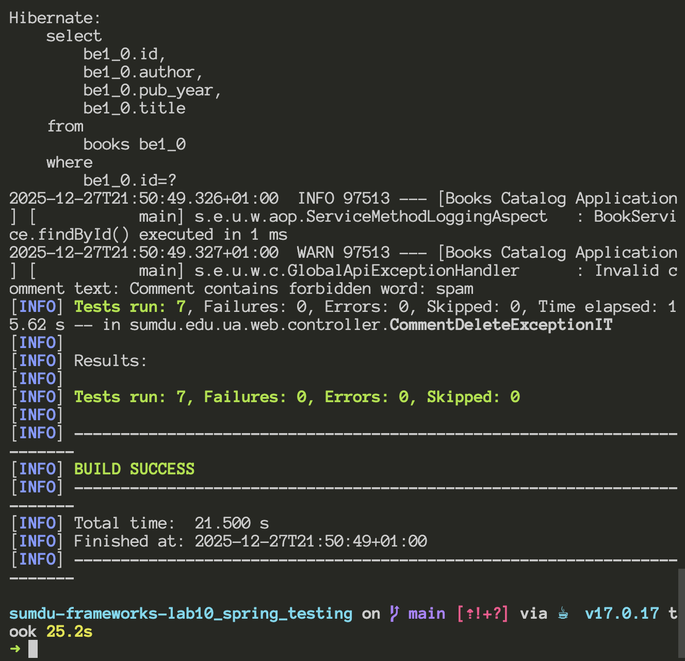

# Spring Boot Books Application

## Lab 10 - Exception Handling, AOP, and Testing in Spring Boot

A multi-layer web application demonstrating exception handling patterns, Aspect-Oriented Programming (AOP) for logging, and comprehensive testing with JUnit 5 and Mockito.

## Technologies

- **Java 17**, **Spring Boot 3.2.0**, **Spring Security**
- **Spring Data JPA / Hibernate**, **Flyway**, **H2 Database**
- **Spring AOP** (aspect-oriented logging)
- **JUnit 5**, **Mockito**, **MockMvc** (testing)

## Role of Exceptions in Multi-Layer Web Applications

In a layered architecture, exceptions provide a clean way to propagate errors from the core (business logic) to the web layer:

| Layer      | Responsibility                                                             |
| ---------- | -------------------------------------------------------------------------- |
| **Core**   | Validates business rules, throws domain-specific exceptions                |
| **Web**    | Catches exceptions via `@RestControllerAdvice`, converts to HTTP responses |
| **Client** | Receives standardized JSON error responses                                 |

This separation ensures:

- Business logic remains free of HTTP concerns
- Consistent error response format across the application
- Clear separation between validation errors and system errors

## Implementation

### 1. CommentService and Custom Exceptions

The `CommentService` in the core module provides comment management with validation:

```java
@Service
public class CommentService {

    private static final int MAX_COMMENT_LENGTH = 1000;
    private static final List<String> FORBIDDEN_WORDS = Arrays.asList("spam", "viagra", "casino");

    @Transactional
    public void delete(long bookId, long commentId, Instant createdAt) {
        if (bookId <= 0) {
            throw new InvalidCommentDeleteException("bookId must be greater than 0");
        }
        if (commentId <= 0) {
            throw new InvalidCommentDeleteException("commentId must be greater than 0");
        }
        if (createdAt == null) {
            throw new InvalidCommentDeleteException("createdAt is required");
        }
        if (Duration.between(createdAt, Instant.now()).toHours() > 24) {
            throw new CommentTooOldException("Comment was created more than 24 hours ago and cannot be deleted");
        }
        repo.delete(bookId, commentId);
    }

    public void validateCommentText(String text) {
        if (text == null || text.isBlank()) {
            throw new InvalidCommentTextException("Comment text cannot be empty");
        }
        if (text.length() > MAX_COMMENT_LENGTH) {
            throw new InvalidCommentTextException("Comment text exceeds maximum length of " + MAX_COMMENT_LENGTH + " characters");
        }
        for (String forbiddenWord : FORBIDDEN_WORDS) {
            if (text.toLowerCase().contains(forbiddenWord)) {
                throw new InvalidCommentTextException("Comment contains forbidden word: " + forbiddenWord);
            }
        }
    }
}
```

#### Custom Exceptions

| Exception                       | Purpose                                   |
| ------------------------------- | ----------------------------------------- |
| `InvalidCommentDeleteException` | Invalid IDs or missing createdAt          |
| `CommentTooOldException`        | Comment older than 24 hours               |
| `InvalidCommentTextException`   | Text too long or contains forbidden words |
| `BookNotFoundException`         | Book not found in database                |

### 2. GlobalApiExceptionHandler

The global REST exception handler converts core exceptions to HTTP responses:

```java
@RestControllerAdvice
public class GlobalApiExceptionHandler {

    private static final Logger log = LoggerFactory.getLogger(GlobalApiExceptionHandler.class);

    @ExceptionHandler(InvalidCommentDeleteException.class)
    public ResponseEntity<Map<String, String>> handleInvalidCommentDeleteException(InvalidCommentDeleteException ex) {
        log.warn("Invalid comment delete request: {}", ex.getMessage());
        return ResponseEntity.status(HttpStatus.BAD_REQUEST)
                .body(Map.of("error", ex.getMessage()));
    }

    @ExceptionHandler(CommentTooOldException.class)
    public ResponseEntity<Map<String, String>> handleCommentTooOldException(CommentTooOldException ex) {
        log.warn("Comment too old for deletion: {}", ex.getMessage());
        return ResponseEntity.status(HttpStatus.BAD_REQUEST)
                .body(Map.of("error", ex.getMessage()));
    }

    @ExceptionHandler(BookNotFoundException.class)
    public ResponseEntity<Map<String, String>> handleBookNotFoundException(BookNotFoundException ex) {
        log.info("Book not found: {}", ex.getMessage());
        return ResponseEntity.status(HttpStatus.NOT_FOUND)
                .body(Map.of("error", ex.getMessage()));
    }

    @ExceptionHandler(InvalidCommentTextException.class)
    public ResponseEntity<Map<String, String>> handleInvalidCommentTextException(InvalidCommentTextException ex) {
        log.warn("Invalid comment text: {}", ex.getMessage());
        return ResponseEntity.status(HttpStatus.BAD_REQUEST)
                .body(Map.of("error", ex.getMessage()));
    }
}
```

#### HTTP Response Mapping

| Exception                       | HTTP Status     | Example Response                                             |
| ------------------------------- | --------------- | ------------------------------------------------------------ |
| `InvalidCommentDeleteException` | 400 Bad Request | `{"error": "bookId must be greater than 0"}`                 |
| `CommentTooOldException`        | 400 Bad Request | `{"error": "Comment was created more than 24 hours ago..."}` |
| `InvalidCommentTextException`   | 400 Bad Request | `{"error": "Comment contains forbidden word: spam"}`         |
| `BookNotFoundException`         | 404 Not Found   | `{"error": "Book not found"}`                                |

### 3. AOP Aspect for Logging

The `CommentServiceLoggingAspect` transparently logs all calls to `CommentService.delete()`:

```java
@Aspect
@Component
public class CommentServiceLoggingAspect {

    private static final Logger log = LoggerFactory.getLogger(CommentServiceLoggingAspect.class);

    @Around("execution(* sumdu.edu.ua.core.service.CommentService.delete(..))")
    public Object logDeleteCall(ProceedingJoinPoint pjp) throws Throwable {
        long start = System.currentTimeMillis();
        Object[] args = pjp.getArgs();
        Long bookId = (Long) args[0];
        Long commentId = (Long) args[1];

        log.info("Calling CommentService.delete(bookId={}, commentId={})", bookId, commentId);

        try {
            Object result = pjp.proceed();
            long time = System.currentTimeMillis() - start;
            log.info("CommentService.delete(bookId={}, commentId={}) finished in {} ms",
                     bookId, commentId, time);
            return result;
        } catch (Exception ex) {
            long time = System.currentTimeMillis() - start;
            log.warn("CommentService.delete(bookId={}, commentId={}) failed in {} ms: {}",
                     bookId, commentId, time, ex.getMessage());
            throw ex;
        }
    }
}
```

The aspect logs:

- Method entry with parameters
- Execution time on success
- Error message and execution time on failure

## Testing

### Unit Tests (CommentServiceTest)

Unit tests for the core service using JUnit 5 and Mockito:

```java
@ExtendWith(MockitoExtension.class)
class CommentServiceTest {

    @Mock
    private CommentRepositoryPort commentRepositoryPort;

    private CommentService commentService;

    @Test
    void delete_withInvalidBookId_throwsInvalidCommentDeleteException() {
        InvalidCommentDeleteException exception = assertThrows(
                InvalidCommentDeleteException.class,
                () -> commentService.delete(0, 1, Instant.now())
        );
        assertEquals("bookId must be greater than 0", exception.getMessage());
        verifyNoInteractions(commentRepositoryPort);
    }

    @Test
    void delete_withCreatedAtOlderThan24Hours_throwsCommentTooOldException() {
        Instant createdAt = Instant.now().minus(25, ChronoUnit.HOURS);
        assertThrows(CommentTooOldException.class,
                () -> commentService.delete(1, 2, createdAt));
        verifyNoInteractions(commentRepositoryPort);
    }

    @Test
    void delete_withValidData_callsRepositoryDelete() {
        commentService.delete(1, 2, Instant.now().minus(1, ChronoUnit.HOURS));
        verify(commentRepositoryPort).delete(1, 2);
    }
}
```

**Test coverage includes:**

- Invalid bookId/commentId validation
- Null createdAt validation
- Comment age validation (24-hour limit)
- Forbidden words detection
- Text length validation
- Successful deletion scenario

### Integration Tests (CommentDeleteExceptionIT)

Integration tests using MockMvc to verify exception handling at the HTTP level:

```java
@SpringBootTest(classes = AppInit.class)
@AutoConfigureMockMvc
class CommentDeleteExceptionIT {

    @Autowired
    private MockMvc mockMvc;

    @MockBean
    private CommentService commentService;

    @Test
    @WithMockUser(roles = "ADMIN")
    void deleteComment_whenCommentTooOld_returnsBadRequest() throws Exception {
        doThrow(new CommentTooOldException("Comment was created more than 24 hours ago and cannot be deleted"))
                .when(commentService).delete(eq(1L), eq(2L), any(Instant.class));

        mockMvc.perform(delete("/comments")
                        .param("bookId", "1")
                        .param("commentId", "2")
                        .param("createdAt", "2024-01-01T00:00:00Z"))
                .andExpect(status().isBadRequest())
                .andExpect(jsonPath("$.error").value("Comment was created more than 24 hours ago and cannot be deleted"));
    }
}
```

## Screenshots

### Successful Comment Deletion with AOP Logging

Console output showing AOP aspect logging the delete operation with execution time:



### Comment Too Old Error (UI Error Page)

Error page displayed when trying to delete a comment older than 24 hours:



### Forbidden Word Validation Error (UI Error Page)

Error page displayed when trying to add a comment containing forbidden words (spam, viagra, casino):


### Unit Tests Passing

All CommentService unit tests passing in the IDE:



### Integration Tests Passing

All integration tests with MockMvc passing:



## Running the Application

```bash
mvn spring-boot:run
```

## Running Tests

```bash
# Run all tests
mvn test

# Run only unit tests
mvn test -Dtest=CommentServiceTest

# Run only integration tests
mvn test -Dtest=CommentDeleteExceptionIT
```

## Conclusions

### Benefits of Global Exception Handling

1. **Centralized error management**: All exceptions handled in one place
2. **Consistent API responses**: Standardized JSON error format
3. **Clean business logic**: Services focus on domain rules, not HTTP
4. **Easy logging**: Centralized logging of all error conditions

### Benefits of AOP for Logging

1. **Non-invasive**: Business code remains clean
2. **Cross-cutting concern**: Applied transparently to multiple methods
3. **Performance monitoring**: Execution time tracking
4. **Debugging support**: Detailed call traces without code modification

### Testing Strategy

1. **Unit tests**: Verify business logic in isolation with mocks
2. **Integration tests**: Verify full request/response cycle with MockMvc
3. **Coverage**: Both happy path and error scenarios tested
